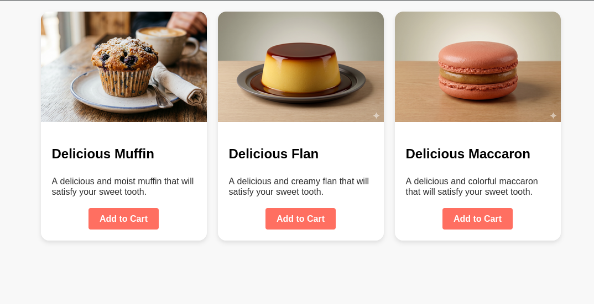

# 🧁 Card Components - Design Centré sur l'Utilisateur

Ce projet pratique est un exercice d'intégration web visant à appliquer les meilleures pratiques de conception d'interfaces (UI/UX) pour des composants de type "Cartes" (*Cards*), dans l'univers de la pâtisserie.

## 🚀 Fonctionnalités & Concepts Appliqués

- **Simplicité & White Space :** Utilisation d'espacements internes (`padding`) et externes rigoureux pour éviter l'encombrement visuel et aérer l'interface.
- **Hiérarchie Visuelle :** Structuration claire de l'information (typographies distinctes pour les titres importants, couleurs adoucies pour les descriptions secondaires).
- **Appel à l'Action (CTA) :** Bouton proéminent avec une couleur contrastée pour guider naturellement le regard de l'utilisateur.
- **Mise en page Moderne (Flexbox) :** Alignement dynamique de 3 cartes de manière parfaitement symétrique, avec gestion automatique de la hauteur des éléments et aimantation des boutons en bas de carte (`margin-top: auto`).

## 🛠️ Technologies Utilisées

- **HTML5** : Structure sémantique
- **CSS3** : Flexbox Layout, transitions fluides au survol (`:hover`), et gestion des ombres portées (`box-shadow`)

## 🎨 Crédits & Ressources

- **Visuels :** L'ensemble des images de pâtisseries (Muffin, Flan, Macaron) présentes dans ce projet ont été générées artificiellement via l'IA **Google Gemini**.

## 📸 Aperçu du Rendu

## 🚀 Live Demo
https://cedricboucard.github.io/muffin-shop-ui/